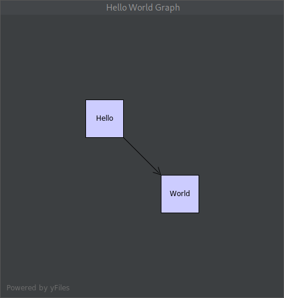
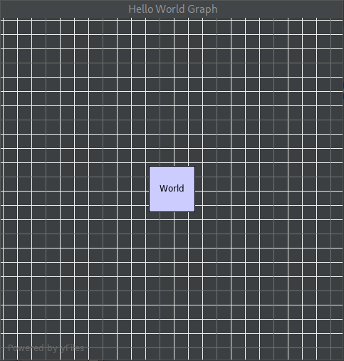

This is a minimal IntelliJ IDEA plugin to show that yFiles graph rendering broke in the 2021.3 release.

When you open a project with this plugin enabled, a simple "Hello World" graph will popup.

This is what it should look like, and does in 2021.2.3:

This is what it looks like in 2021.3:

A minor issue is that the default grid settings changed, but as a workaround those can be set explicitly.

The biggest problem here is that the position of the nodes are ignored.

The nodes are manually placed, but in 2021.3 there is no longer any way of manually placing them, so they just overlap.
